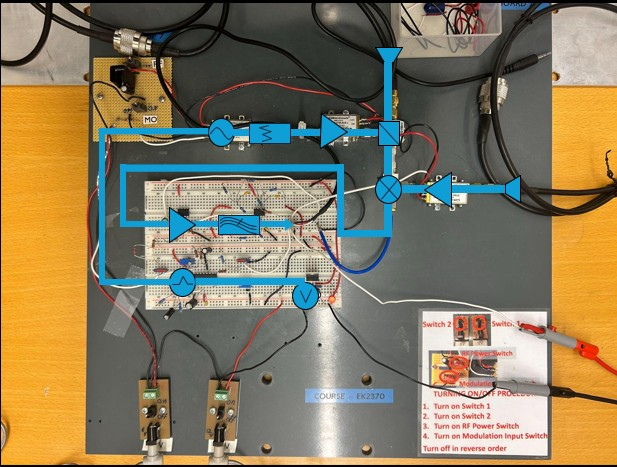
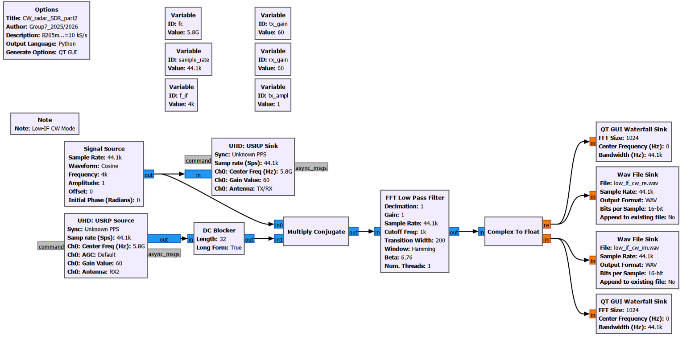
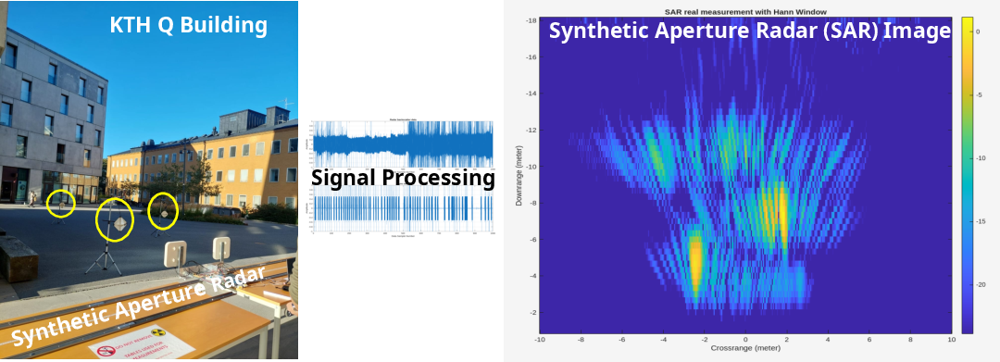

# EK2370 — Build Your Own Radar System
**KTH Royal Institute of Technology · Group 7 · 2025**
Bingxue Xu · Nikita Dubrovskyi · Rafael Rodrigues · Stefano Crescenza

We designed, implemented, and evaluated two radar systems capable of measuring radial velocity, range, and reconstructing Synthetic Aperture Radar (SAR) images.

---

## What We Built

<table>
<tr>
<td align="center" width="50%">
  
<b>2.4 GHz Hardware Radar (COTS)</b> 
Breadboard-assembled from discrete RF components — VCO, mixer, LNA, power splitter, and a baseband amplifier/filter stage
</td>
<td align="center" width="50%">
  
<b>5.8 GHz Software-Defined Radio (SDR)</b> 
USRP B200mini platform with GNU Radio signal processing pipeline — CW and Low-IF CW modes
</td>
</tr>
</table>

---

## Results

<table>
<tr>
<td align="center" width="50%">
<b>Real-Time Velocity Measurement</b> 
CW Doppler mode: the received echo is mixed to baseband and an STFT is applied over successive time windows to produce a velocity–time spectrogram. Two targets are simultaneously resolved via peak detection and tracked across frames.  
<video src="documents/images/real-time velocity measurment.MP4" controls width="380"></video>
<em>SDR, 5.8 GHz, Low-IF CW mode</em>
</td>
<td align="center" width="50%">
<b>Real-Time Range Measurement</b> 
FMCW mode: a linear frequency chirp is transmitted; an FFT of the dechirped beat signal per chirp yields range bins. The range–time spectrogram is updated continuously, resolving moving targets in real time.  
<video src="documents/images/real-time range measurment.MP4" controls width="380"></video>
<em>COTS hardware, 2.4 GHz, FMCW mode</em>
</td>
</tr>
</table>

---

### Synthetic Aperture Radar (SAR) Imaging
**RMA** reconstructs a 2D spatial image from radar echoes collected at multiple positions along a rail, by transforming the data into the frequency domain, correcting for the curved propagation path each target creates, and inverting back to produce a focused reflectivity map. We applied this to real outdoor measurements at KTH, recovering the positions of three corner reflectors placed at different distances from the radar.

  

---

## Report
For a detailed signal processing and implementation of algorithms, see the 📄 [Final project report](documents/Final%20report/EK2370_Final_Report.pdf).
